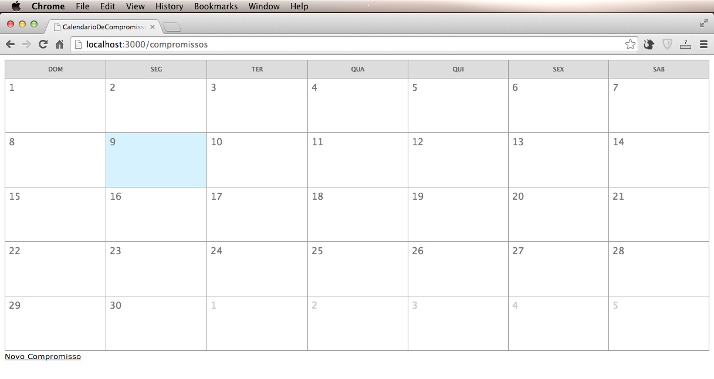
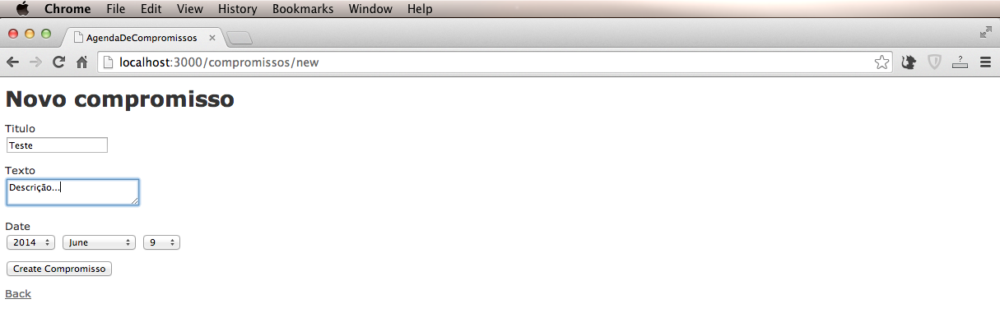
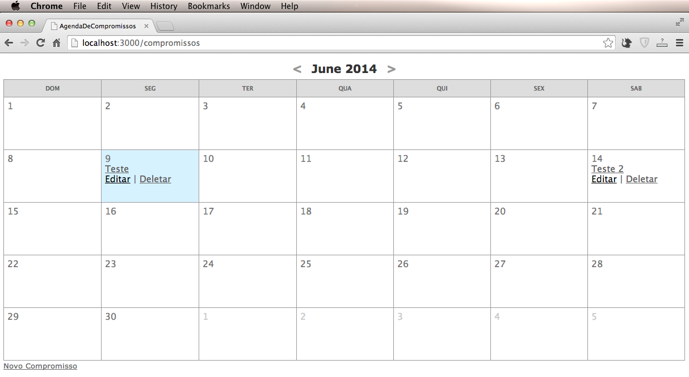

Uma forma muito legal de agregar uma agenda de compromissos ou eventos no seu projeto é utilizando um calendário. No Ruby on Rails é muito simples fazer isso com a ajuda da gem **table_builder**.

Crie um novo projeto e gere o modelo de compromisso.


$ rails new AgendaDeCompromissos
$ rails g scaffold Compromisso titulo:string texto:text date:date
$ rake db:migrate


Instale a gem table_builder, adicionando na Gemfile:

gem "watu_table_builder", :require => "table_builder"


Depois, no terminal digite:

$ bundle install


Em view/compromissos/index.html.erb coloque o calendário: 


	<%= calendar_for(@compromissos) do |t| %>
	<%= t.head('DOM','SEG', 'TER', 'QUA', 'QUI', 'SEX', 'SAB') %>
	<%= t.day do |day, compromissos| %>
	<%= day.day %>
	<% compromissos.each do |compromisso| %>
	<%= h(compromisso.titulo) %>
	<% end %>
	<% end %>
	<% end %>

<%= link_to 'Novo Compromisso', new_compromisso_path %>


Crie um arquivo css para definir o estilo do calendário,
assets/stylesheets/calendar.css:

#calendar table {
border-collapse: collapse;
width: 100%;
}

#calendar td,
#calendar th {
font-family: "Lucida Grande",arial,helvetica,sans-serif;
font-size: 10px;
padding: 6px;
border: 1px solid #999;
}

#calendar th {
background: #DDD;
color: #666;
text-align: center;
width: 14.2857142857143%;
}

#calendar td {
background: #FFF;
color: #777;
height: 80px;
vertical-align: top;
font-size: 16px;
}

#calendar .notmonth {
color: #CCC;
}

#calendar #month {
margin: 0;
padding-top: 10px;
padding-bottom: 10px;
text-align: center;
}

#calendar #month a, #calendar #month a:hover {
text-decoration: none;
padding: 0 10px;
color: #999;
}

#calendar .today {
background-color: #D7F2FF;
}

#calendar ul {
margin: 0;
margin-top: 5px;
padding: 0;
list-style: none;
}

#calendar li {
margin: 0;
padding: 0;
font-size: 11px;
text-align: center;
}


Nessa altura já temos o calendário com estilo criado:
<figure>
	
</figure>

Agora setamos o compromisso em app/controllers/compromissos_controller.rb para receber a data presente:


def index
	@compromissos = Compromisso.all
	@date = params[:month] ? Date.parse(params[:month]) : Date.today
end


Para colocar o mês e o ano na view e incluir os botões de editar e deletar, fazemos o seguinte em app/views/projects/index.html.erb:



	<%= calendar_for(@compromissos) do |t| %>
	<%= t.head('DOM','SEG', 'TER', 'QUA', 'QUI', 'SEX', 'SAB') %>
	<%= t.day do |day, compromissos| %>
	<%= day.day %>
	<% compromissos.each do |compromisso| %> 
	<%= link_to h(compromisso.titulo), compromisso %> 
	<%= link_to 'Editar', edit_compromisso_path(compromisso) %> | <%= link_to 'Deletar', compromisso, method: :delete, data: { confirm: 'Tem certeza?' } %>
	<% end %>
	<% end %>
	<% end %>



Adicionar as setas para navegar pelo calendário, app/views/projects/index.html.erb: 



	<h2 id="month">
		<%= link_to "<", :month => (@date.beginning_of_month-1).strftime("%Y-%m-%d") %>
		<%=h @date.strftime("%B %Y") %>
		<%= link_to ">", :month => (@date.end_of_month+1).strftime("%Y-%m-%d") %>
	</h2>
	<%= calendar_for @compromissos, :year => @date.year, :month => @date.month do |t| %>
	<%= t.head('DOM','SEG', 'TER', 'QUA', 'QUI', 'SEX', 'SAB') %>
	<%= t.day do |day, compromissos| %>
	<%= day.day %>
	<% compromissos.each do |compromisso| %> 
	<%= link_to h(compromisso.titulo), compromisso %> 
	<%= link_to 'Editar', edit_compromisso_path(compromisso) %> | <%= link_to 'Deletar', compromisso, method: :delete, data: { confirm: 'Tem certeza?' } %>
	<% end %>
	<% end %>
	<% end %>

<%= link_to 'Novo Compromisso', new_compromisso_path %>


Resultado final:
<figure>
	
</figure>

<figure>
	
</figure>

Código fonte: <a href="https://github.com/alinebone/AgendaDeCompromissos">**Github**</a> 
Demo: <a href="http://tutorialagenda.herokuapp.com/compromissos">**Heroku**</a>

Obrigada!
