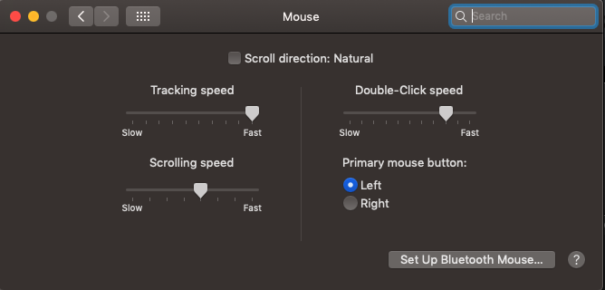
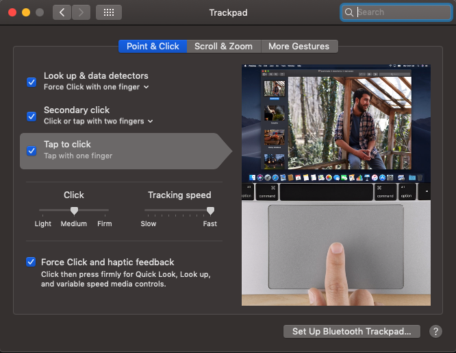
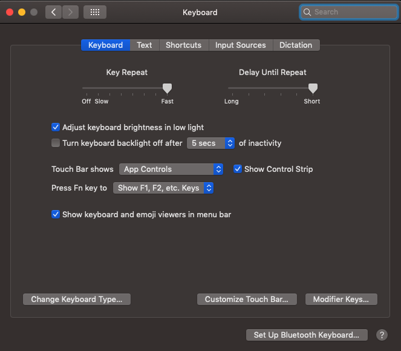
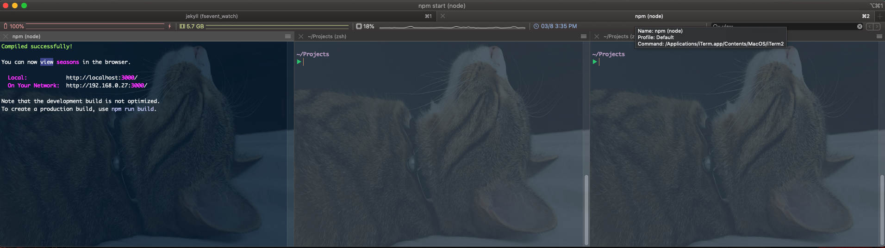
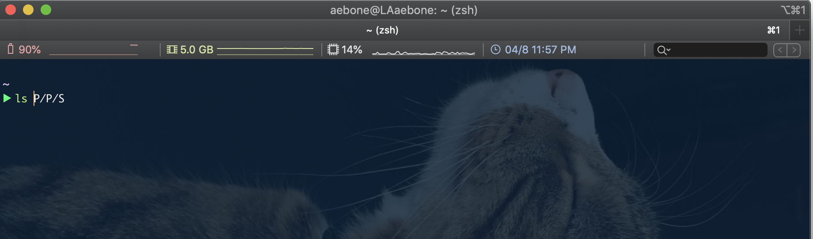
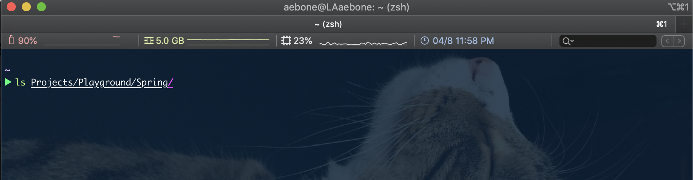
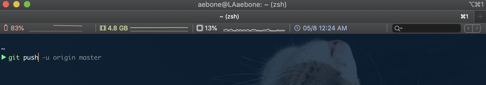

In order to gain some time at work, we have a group of tools and configurations set on our laptops to make things easier and faster. They are not rules. But in general, people who adopt it, end up liking most of them.  
At ThoughtWorks we usually work with Macbook Pro with Touch Bar, so some tips are specific for it. But most of them are configurable on any laptop/OS.

## 1. Configure the Function Keys to appear whenever you want
In the beginning, it was annoying to lose the Function Keys because of the Touch Bar. The Functions Keys are a very good resource to use the shortcuts that IntelliJ or any other IDE provide us while coding.
To solve this, go to:  

`System Preferences > Keyboard > Shortcuts > Function Keys`  

Then add whatever application you want. The added applications will keep the Function Keys visible while the application window is being used, and you don't lose the regular things that the Touch Bar will show while using other applications.

<figure>
	
</figure>
<figure>
		
</figure>

## 2. Fast mouse!
Since we are talking about speed, let's make the mouse run! If you're not used to the fast-tracking speed it can be uncomfortable in the beginning, but give it a try for 10 minutes.
To configure the mouse, go to:  
`System Preferences > Mouse`, and set the <strong>Tracking speed</strong> to Fast.

<figure>
	
</figure>

If you work with the Trackpad, go to:
`System Preferences > Mouse`, and do the same, set the <strong>Tracking speed</strong> to Fast.

<figure>
	
</figure>

## 3. Latency and Key Repeat

Similar to the previous tip. This one makes your keyboard keys faster. Go to:  
`System Preferences > Keyboard`, set <strong>Key Repeat</strong> to Fast, and <strong>Delay Until Repeat</strong> to Short.

<figure>
	
</figure>
      
## 4. iTerm
Iterm is an alternate terminal for macOS. It has some nice features like the divided panel <i>(Cmd + D)</i>, the search <i>(Cmd + F)</i>, and a better navigation between tabs (Cmd + Arrows).  
The only thing that used to bother me was the "new tab" option <i>(Cmd T)</i> which by default, open a new tab in the root directory. For me is more useful when it opens in the current directory. If it makes sense to you too, just go to `Preferences > Profiles > Reuse previous session's directory`. Done!

<figure>
	
</figure>

<figure>
	
</figure>

## 5. Z Shell - zsh
Z Shell is an alternate unix shell. It has some nice features like the Tab completion. To use the Tab completion type `cd`, then the first letters of the directory names and press TAB.

<figure>
	
</figure>

Z shell also keeps a shared history between sections. Therefore, when I press the Arrow Up key to see my last commands, I'll see indeed my last commands, regardless of the tab or window I am at the moment. The history is also good because I can start to type the command I want, and press the Arrow Up key, then the shell will suggest the last command I typed with those initial letters.  

The <i>cd</i> command is not necessary anymore, unless to do the Tab completion tip.    

You can also use the command <i>ls</i> without having to type whole directory names, just type the first few letters, press TAB, and that is enough to make it work.

<figure>
	
</figure>
<figure>
	
</figure>

How to install zsh:  
First, check if you already have it.
Try `zsh --version` on your iTerm. 
If you don't have it, run (assuming you have <i>homebrew</i>):  

`$ brew install zsh zsh-completions`  

or  

`$ sudo port install zsh zsh-completions`  

To set zsh as your default shell, execute the following:  

`chsh -s /bin/zsh`

## 6. Oh-my-zsh (Fun part!)
Now things will start to be fun! Oh-my-zsh is a framework to configure zsh. You can install tons of plugins to make your life easier! I'll list just my favorites here.  
But first, to install oh-my-zsh type:  


$ sh -c "$(curl -fsSL https://raw.githubusercontent.com/robbyrussell/oh-my-zsh/master/tools/install.sh)"


### 6.1 Syntax Highlighting Plugin
It shows the red color when the command is wrong, and green when it's right.

<figure>
	
</figure>

To install it, clone this repository in oh-my-zsh's plugins directory:


$ git clone https://github.com/zsh-users/zsh-syntax-highlighting.git ${ZSH_CUSTOM:-~/.oh-my-zsh/custom}/plugins/zsh-syntax-highlighting


Then activate the plugin in `~/.zshrc`:


plugins=(zsh-syntax-highlighting)


### 6.2 zsh-AutoSuggestion 
As the name says, it shows a suggestion when you start to type. When the suggestion is the correct one, just press the Arrow Right key.

<figure>
	
</figure>

The suggestions are based on configured <i>alias</i> (see more below), history of commands, syntax of commands, etc.

To install it, clone this repository into $ZSH_CUSTOM/plugins (by default ~/.oh-my-zsh/custom/plugins)


$ git clone https://github.com/zsh-users/zsh-autosuggestions ${ZSH_CUSTOM:-~/.oh-my-zsh/custom}/plugins/zsh-autosuggestions


and again, add the plugin to the list of plugins inside `~/.zshrc`:


plugins=(zsh-autosuggestions)


### 6.3 Autojump
The shortcut `j` goes to the most used directory. And if you type `j` +  the name of the folder or project you want (or just the first few letters), it will go straight to where you want.  

<figure>
	
</figure>

To install it:  

`$ brew install autojump`

Then add the plugin in `~/.zshrc`:


plugins=(autojump)


### 6.4 Git
The coolest thing here is the possibility to use fast shortcuts for git commands, some examples are:

`gst` - git status  
`gup` - git pull --rebase  
`gp` - git push  
`gcmsg`- git commit -m  
`gd` - git diff  
`gaa` - git add --all

You can find the complete cheatsheet [here](https://github.com/robbyrussell/oh-my-zsh/wiki/Cheatsheet).

To use it, add git to the plugins array in your zshrc file, in the end, your plugins array will be something like:  


plugins=(  
    git
    autojump  
    command-not-found  
    tig
    zsh-syntax-highlighting
    zsh-autosuggestions
)


### 6.5 Alias
You can also personalize the alias you want in the `.zshrc` file. To do it, you just have to use the `alias` keyword inside `~/.zshrc`:  


alias softReset="git reset --soft head~1"
alias hardReset="git reset --hard head~1"
alias amendCommit="git commit --amend"
alias gphm="git push heroku master"


### 6.6 Themes
To finish, there are tons of beautiful themes available to you personalize your terminal. I use the `avit` theme. 
You can find all of them [here](https://github.com/robbyrussell/oh-my-zsh/wiki/Themes).  

To set the theme, add inside `~/.zshrc`:  


ZSH_THEME="avit"


That's all!